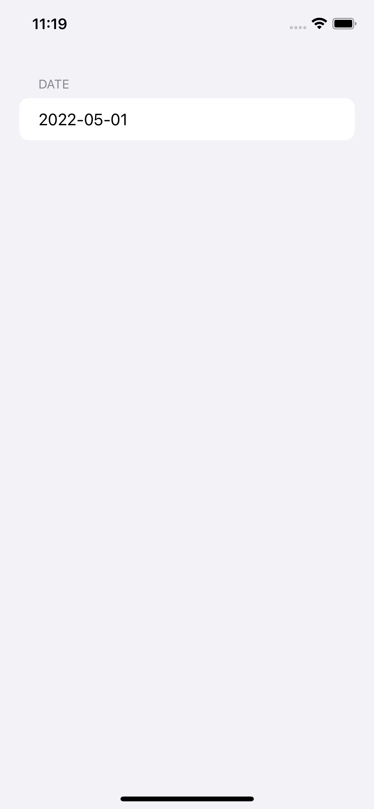

# DatePickerTextField

shows a TextField associated with a DatePicker

# Screenshot

 

# How to Used

```
// Simple Date Picker
DatePickerTextField(
	placeholder: "input date", 
	pickerType: .inline, date: self.$viewModel.selectedData
)
```

